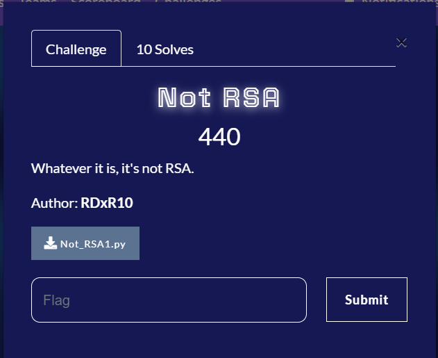

This was a crypto challenge from GrabCON CTF 2021. This is the prompt:



This is the script we were provided in the challenge:

```python
from math import sqrt
import random
from Crypto.Util.number import bytes_to_long


N = 2433984714450860961589027518159810370561856716063956157321856705975948489337570445957833120668443867975490363019335530343179129689501017626817947777263721
c = 1378297008929492435762470180953416238081302819750327089183697281160938504327642742017058360280755400054663296904328307673692314945545918393502459480987913
a = int(sqrt(N) + 1)
b = random.randint(0,9999999999)

flag = b"REDACTED"
m = bytes_to_long(flag)

c = ((a**m)*(b**(a-1)))%((a-1)*(a-1))
```

It does look a lot similar to RSA. But, as said in the challenge itself, it is not. It is actually:[Paillier cryptosystem](https://en.wikipedia.org/wiki/Paillier_cryptosystem)

Comparing the encrypting function of the script given and the wikipedia page, we can make some comparsions. Here, we can see that, **n** here is equal to **a-1**. Now, we need to factorise n. For this, I used [Alpertron](https://www.alpertron.com.ar/ECM.HTM)

and in the end, I wrote this script:

```python
from Crypto.Util.number import long_to_bytes
from gmpy2 import *

N = 2433984714450860961589027518159810370561856716063956157321856705975948489337570445957833120668443867975490363019335530343179129689501017626817947777263721
c = 1378297008929492435762470180953416238081302819750327089183697281160938504327642742017058360280755400054663296904328307673692314945545918393502459480987913

#Factorised from Alpertron
p=194545307101606186694882845905355574989
q=253593527157826835431576067999755840801

a = iroot(N,2)[0] + 1
n = a-1
g = n+1
lamb = (p-1)*(q-1)
mu = pow(lamb,-1,n)


def encrypt(m):
    c = ((a**m)*(b**n))%(n**2)
    print(c)

def decrypt(c):
    x = pow(c,lamb,(n**2))
    L = (x-1)//n
    m = pow(L*mu,1,n)
    flag = long_to_bytes(m).decode()
    print(flag)

decrypt(c)
```

sqrt() function wasn't giving me the proper square root, so I used python gmpy2 module.
Running this, we get the flag:
```
GrabCON{i75_p4ill13r_f0lks}
```
